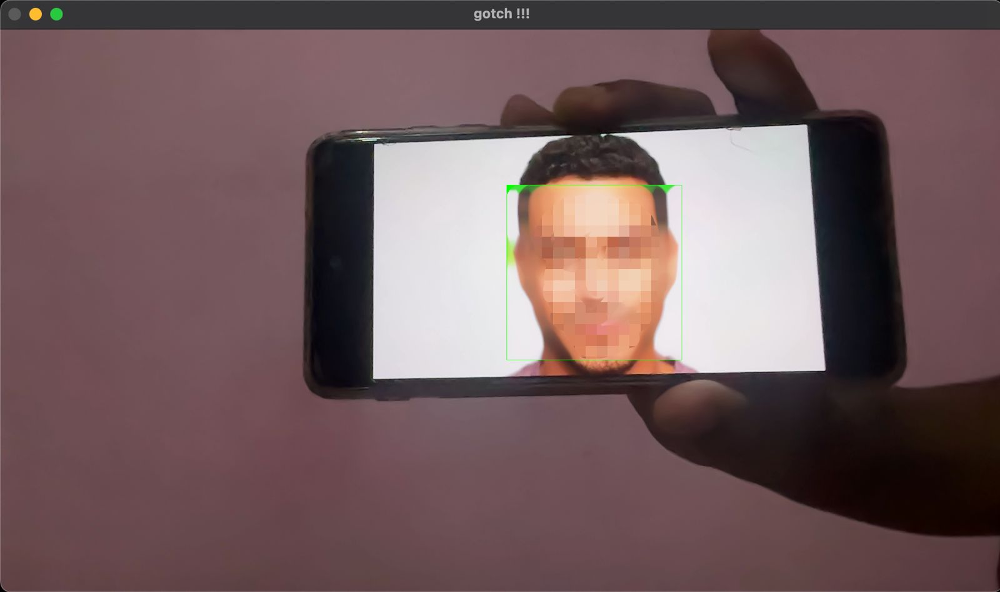

# Real-Time Face Blurring with OpenCV

This project demonstrates a real-time face blurring application using OpenCV. It captures video from your webcam, detects faces in real-time, and applies a median blur effect to the detected faces.

## Requirements

- Python 3.x
- OpenCV

## Installation


1. **Install Requirements**:

   ```bash
   pip install -r requirements.txt
   ```


## Usage

1. Run the script:
   ```bash
   python main.py
   ```

2. The webcam will open, and the application will begin detecting faces. Detected faces will be blurred in real-time.

3. Press `q` to exit the application.

## Code Explanation

- **Importing Libraries**: The script uses OpenCV for video capture and face detection.
  
- **Loading the Cascade Classifier**: The `haarcascade_frontalface_default.xml` file is loaded to detect faces in the video frames.

- **Capturing Video**: A video stream from the default camera (index 0) is initiated.

- **Face Detection Loop**:
  - Each frame is read from the video stream.
  - The frame is converted to grayscale for face detection.
  - `detectMultiScale` is used to detect faces in the grayscale image.
  - Detected faces are blurred using a median filter applied to the corresponding regions of the original frame.
  
- **Displaying Video**: The processed video is displayed in a window titled "gotch !!!".

- **Exiting the Application**: Pressing the 'q' key will terminate the video stream and close all windows.

## Result



## Acknowledgements

- This project uses the OpenCV library, which is a powerful tool for image processing and computer vision tasks.
- Haar Cascades for face detection are provided by OpenCV, which allows for efficient face detection in images and video.

## Signature

*Vivek Prakash*

[Linkedin](https://www.linkedin.com/in/vivek-prakash-b46830283/)