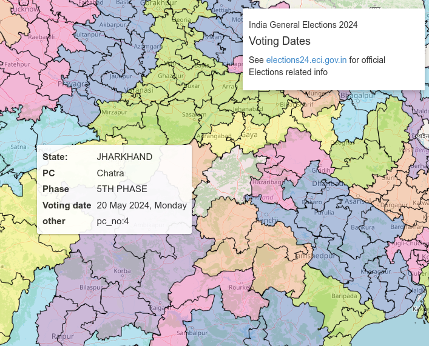

# India Elections 2024 map 

Showing voting dates on parliamentary constituency maps

- colors as per full-India PC map shown on https://elections24.eci.gov.in/
- data from https://gist.github.com/planemad/1e2b63f6b9806970db749f19980ffd25
- which is sourced from https://bharatmaps.gov.in/BharatMaps/Home/Map
- datameet thread: https://groups.google.com/g/datameet/c/vcuMiTiK5XQ

