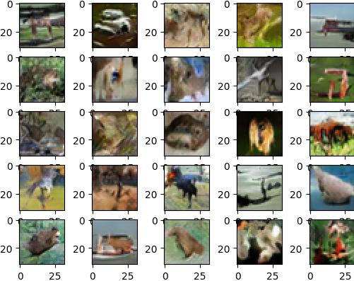

# GAN-Based Image Generation with CIFAR-10

This project demonstrates the use of Generative Adversarial Networks (GANs) to generate images based on the CIFAR-10 dataset. The model consists of a discriminator and a generator. The discriminator is trained to distinguish between real and fake images, while the generator is trained to produce images that can fool the discriminator.

## Dataset

The CIFAR-10 dataset is used for training the GAN model. It contains 60,000 32x32 color images divided into 10 classes (airplane, automobile, bird, cat, deer, dog, frog, horse, ship, truck). For more information, visit [CIFAR-10 Dataset](https://www.cs.toronto.edu/~kriz/cifar.html).

## Project Structure

- **discriminator()**: Constructs the discriminator model that classifies images as real or fake.
- **generator(latent_dim)**: Constructs the generator model that creates fake images from a latent space.
- **gan(g, d)**: Combines the generator and discriminator models to create a GAN.
- **train_gan(g, d, g1, df, latent_dim, n_epochs, batch_size)**: Trains the GAN model using the CIFAR-10 dataset.
- **train_discriminator(model, g, s)**: Trains the discriminator model.
- **load_real_data(S)**: Loads a batch of real images from the CIFAR-10 dataset.
- **gen_latent_points(S, n)**: Generates random points in the latent space.
- **load_fake_data(g, S, n=100)**: Generates fake images using the generator model.

## Training

The GAN is trained over 200 epochs, with intermediate models saved every 10 epochs to track the progress of both the generator and discriminator. During each epoch, the discriminator is trained on both real and fake images, aiming to correctly classify them. Simultaneously, the generator is trained to produce images that can fool the discriminator.

Each training iteration involves:
- **Batch Size**: The model is trained with a batch size of 128, where half of the batch contains real images and the other half contains fake images generated by the generator.
- **Latent Space Dimension**: The generator uses a latent space dimension of 100, meaning it generates images from 100 random numbers.
- **Saving Models**: The generator (`generator.h5`), discriminator (`discriminator.h5`), and combined GAN (`gan.h5`) models are saved every 10 epochs for later use or analysis.
- **Image Generation**: After each save, the generator produces a set of images from the latent space. These images are then scaled from the range `[-1, 1]` to `[0, 1]` and saved as JPEG files (e.g., `gan_generated_image_epoch_{i+1}.jpg`), allowing you to visually track the quality of the generated images as training progresses.

## Results

Throughout training, the generator's ability to produce realistic images improves. You can observe the progression by examining the generated images saved every 10 epochs. The final models are capable of generating images that closely resemble the real images in the CIFAR-10 dataset.

## Conclusion

This project demonstrates the power and versatility of Generative Adversarial Networks (GANs) in generating realistic images from random noise, using the CIFAR-10 dataset. Throughout the training process, the generator model learns to produce increasingly realistic images, while the discriminator model becomes more adept at distinguishing between real and fake images. Although the GAN model implemented here is relatively simple, it serves as a strong foundation for understanding and exploring more advanced GAN architectures.
