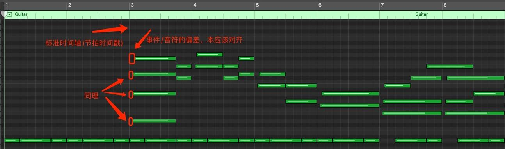
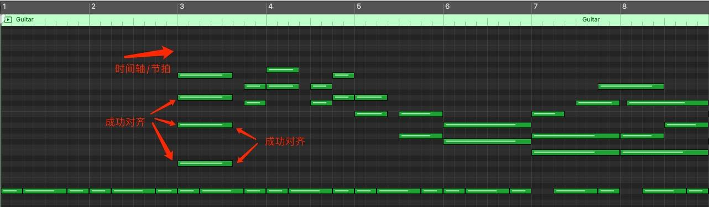
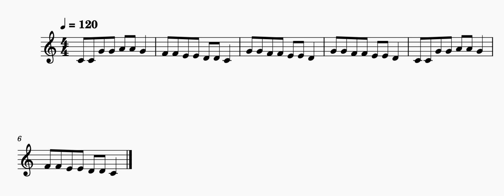
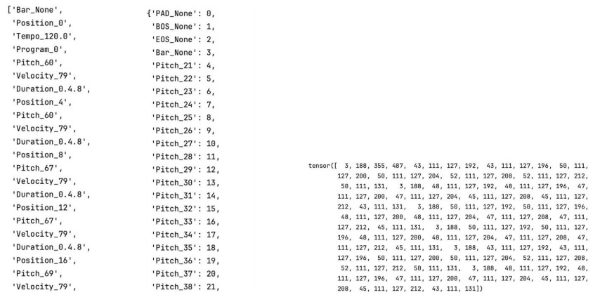
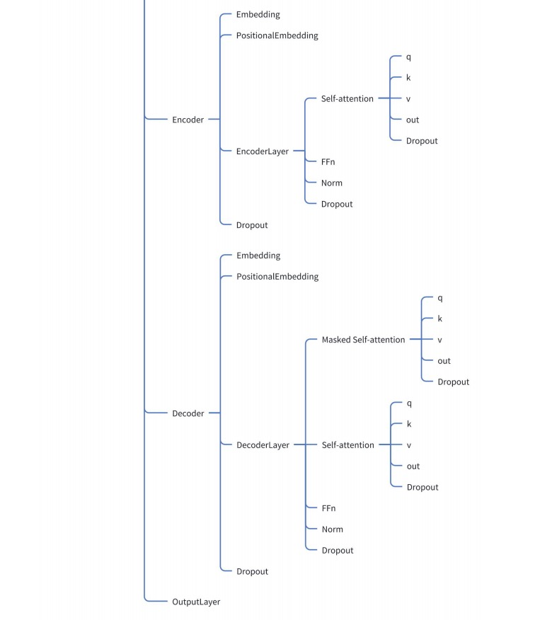
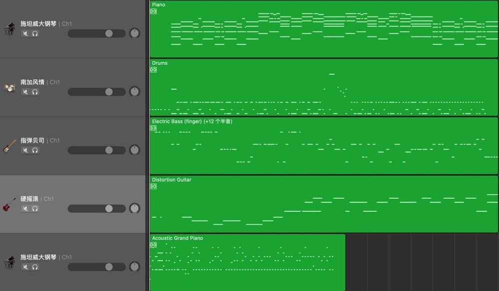

# MIDI Music Accompaniment Generator

​	In this project, I implemented an automatic music accompaniment model. This model can take a single-track melody MIDI file as input and output a corresponding accompaniment MIDI file featuring other instruments such as guitar, bass, and drums. To accomplish the above tasks, I also completed numerous additional efforts, which I will elaborate on below.

## Rule-based music score alignment algorithm

​	Among the numerous MIDI files collected in various ways for training purposes, a significant portion consists of "real" MIDI files generated from instrumental performances. The notes and events in these real performances contain many factors, such as the performer's emotions, and are often dynamic and uncertain. Therefore, there are timing errors in the performance beats, making it difficult to align precisely with the time axis corresponding to the beats. This results in the events recorded in these MIDI files being advanced or delayed relative to the standard musical score on the time axis, further generating inaccurate notes during the music conversion process. Specifically, this manifests in the score as the appearance of numerous sixteenth notes, thirty-second notes, dotted notes, and so forth. This will make it difficult for the model to learn the correct characteristics of the music and significantly reduce learning efficiency. To address this issue, I have developed a rule-based music score alignment algorithm, with the following effects:

​	Before the algorithm:

​	After the algorithm:

## Tokenization

​	Convert MIDI files into tensor arrays for input into the model.For an example:

​	Given a MIDI music file:

​	Tokenize and turn it into tensor array:

## Build the model

​	Build a model based on transformer.The structure of the model is shown in the diagram below.

## Train and Evaluate

​	Train the model and then evaluate its performance. The specific results are shown in the table below.The values of the hyperparameters adjusted during the training process are also presented below.

​	Hyperparameters:

| Hyperparameters | Value  |
| :-------------: | :----: |
|       lr        | 0.0001 |
|     d_model     |  512   |
|      d_ff       |  2048  |
|    n_layers     |   6    |
|      heads      |   8    |
|  dropout_rate   |  0.2   |
|    n_epochs     |   60   |

​	Train accuracy:

|       Model       | Accuracy |
| :---------------: | :------: |
|  DrumTransformer  |  88.7%   |
| PianoTransformer  |  91.6%   |
| GuitarTransformer |  85.3%   |
|  BassTransformer  |  89.7%   |

​	Test accuracy:

|       Model       | Accuracy |
| :---------------: | :------: |
|  DrumTransformer  |  75.3%   |
| PianoTransformer  |  71.5%   |
| GuitarTransformer |  64.3%   |
|  BassTransformer  |  67.1%   |

## Result

​	Finally, let's demonstrate the effectiveness of the model.

​	For a given main melody MIDI music file:

​	The model can generate the auto_accompaniment MIDI file:

