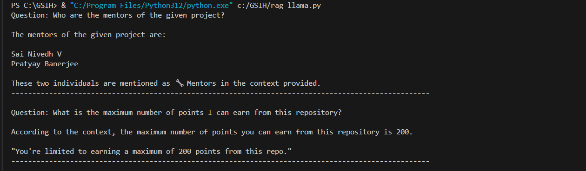

# RAG Chatbot
Most large language models can only provide information based on the corpus of data that they’ve been trained on.
These models might hallucinate if they don't have the required data or context.
This is where RAG or Retrieval-Augmented-Generation helps.

By incorporating a retriever, RAG pulls relevant information from external knowledge sources, such as databases or documents, to enrich the generated output with up-to-date, contextually accurate information. This approach helps to mitigate the limitations of static model training data, enabling real-time responses that adapt to the specific needs of each query.

---

The following technologies are used in making of this RAG based chatbot:

- sentence-transformers/all-MiniLM-l6-v2 as sentence embedding model
- RecursiveCharacterTextSplitter for chunking text
- Llama3.1 as the LLM
- FAISS as Vector DB

---
### Outputs

I had made a sample text file of the README of the [ML-Nexus](https://github.com/UppuluriKalyani/ML-Nexus) repo.

* Questions I asked:
1. Who are the mentors of the given project?
2. What is the maximum number of points I can earn from this repository?

* Answers:

    
