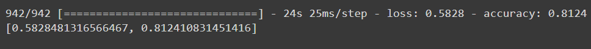
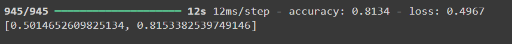

# Guide Through the project SkimLit

## Overview

SkimLit is an implementation of the SkimLit model, designed to efficiently summarize text and provide insights into the main ideas. This project diverges from the original paper by incorporating several enhancements and modifications to improve performance and usability.I created 3 different model for this project and all models are avaliable in *SkimLit-Models* folder but for front-end I will go with the model with best accuracy.

As all models trained and tested on PubMed dataset so it will work best on summerizing the content related to medical research.The dataset is available on *Dataset* folder

## Table of Contents

- [Features](#features)
- [Installation](#installation)
- [Demo]()
- [Results](#results)
- [Important_Notes](#important-notes)

## Features

- Summarizes long texts into concise, easy-to-read summaries.
- User-friendly interface for ease of use.

## Installation

To get started with SkimLit, clone the repository and install the required dependencies:

```bash
git clone https://github.com/yourusername/SkimLit.git
cd SkimLit
pip install -r requirements.txt
```

## Demo

[Demo_Video](./Result/Skimlit_Demo.mp4)

## Results





## Important Notes
-There is some issues with using keras tunner with pretrained embedding layer(**Universal Sentence Encode**) but for tensorflow version 2.15.0 that model was trained without any issue so if anyone want to train model-2 then please degrade the tensorflow verson to 2.15.0
-In streamlit I used model-1 so I write the data preprocessing steps accordingly for other kind of model like multimodel and model with **charater-level embedding and vectorizer** you have to change the dataprocessing steps accordingly.
 