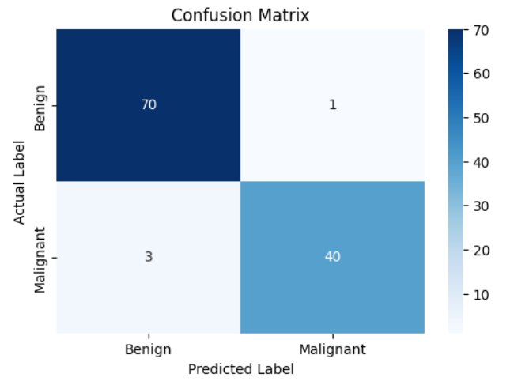
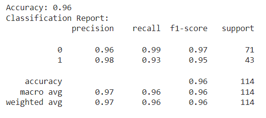
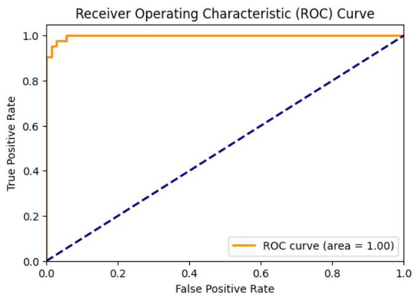

# Results of Breast Cancer Classification

This document presents the results of the breast cancer classification task using the Naive Bayes Classifier.

## Model Accuracy

The model achieved an accuracy of **96%** on the test dataset.

## Classification Report

The detailed classification report is shown below:

### Interpretation of the Classification Report

- **Precision**: The ratio of correctly predicted positive observations to the total predicted positives. High precision indicates that the model has a low false positive rate.
- **Recall**: The ratio of correctly predicted positive observations to all actual positives. High recall indicates that the model has a low false negative rate.
- **F1-score**: The weighted average of precision and recall. It is a good metric to use when you want a balance between precision and recall.
- **Support**: The number of actual occurrences of the class in the specified dataset.

## Screenshots

### Confusion Matrix

### Classification Report

### ROC Curve

## Conclusion

The Naive Bayes Classifier effectively classifies breast cancer tumors with high accuracy. The results indicate a strong performance, making it a suitable choice for this classification task.
