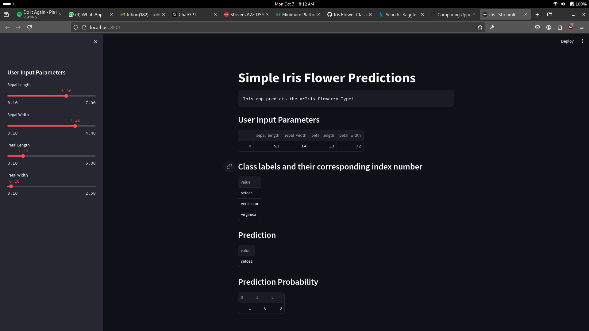

# **Iris Flower Classification with Random Forest**

This project implements a simple machine learning model to classify Iris flower species using a **Random Forest Classifier**. The model is deployed in a web app built using **Streamlit**, allowing users to input custom feature values and predict the species of the Iris flower.

## **Table of Contents**
- [**Iris Flower Classification with Random Forest**](#iris-flower-classification-with-random-forest)
  - [**Table of Contents**](#table-of-contents)
  - [**Project Overview**](#project-overview)
  - [**Dataset**](#dataset)
  - [**Model**](#model)
    - [**Random Forest Classifier**](#random-forest-classifier)
  - [**Requirements**](#requirements)
  - [**How to Run**](#how-to-run)
  - [**Usage**](#usage)
    - [**Predicting Iris Species**](#predicting-iris-species)
  - [**Future Improvements**](#future-improvements)
  - [**Output**](#output)

---

## **Project Overview**

The Iris Flower Classification project is a machine learning solution that predicts the species of an Iris flower (Setosa, Versicolor, or Virginica) based on four input features:
- Sepal Length
- Sepal Width
- Petal Length
- Petal Width

A **Random Forest Classifier** is used to perform this classification, and a **Streamlit** web app is provided for easy interaction. Users can input flower feature values and see the predicted species instantly.

The project is implemented entirely within a single Python file, `iris.py`, which contains the code for both the machine learning model and the web app interface.

---

## **Dataset**

The dataset used in this project is the famous **Iris dataset**, which is included in the `scikit-learn` library. It contains:
- 150 samples
- 3 species of Iris flowers (Setosa, Versicolor, Virginica)
- 4 features (sepal length, sepal width, petal length, petal width)

The dataset is balanced, with each species having 50 samples.

---

## **Model**

### **Random Forest Classifier**
The classification model is built using the **RandomForestClassifier** from `scikit-learn`. Random Forest is an ensemble learning method that fits multiple decision trees and averages their predictions to improve accuracy and control overfitting.

**Key characteristics of Random Forest:**
- It is robust to noise.
- It can handle both classification and regression tasks.
- It avoids overfitting by averaging multiple decision trees.

---

## **Requirements**

To run this project, you need the following Python packages:

```bash
streamlit==1.25.0
pandas==2.1.1
scikit-learn==1.3.0
```

These dependencies are also listed in the `requirements.txt` file.

---

## **How to Run**

Follow these steps to set up and run the project on your local machine:

1. **Clone the repository:**
   ```bash
   git clone <repo-url>
   cd <repo-directory>
   ```

2. **Install the required packages:**
   Use the `requirements.txt` file to install the necessary dependencies:
   ```bash
   pip install -r requirements.txt
   ```

3. **Run the Streamlit app:**
   Use the following command to launch the app:
   ```bash
   streamlit run iris.py
   ```

4. **Open the app:**
   Once the app is running, it will automatically open in your default browser. If not, navigate to `http://localhost:8501/` in your browser.

---

## **Usage**

### **Predicting Iris Species**

1. The Streamlit app provides a simple user interface where you can input the following features:
   - Sepal length
   - Sepal width
   - Petal length
   - Petal width

2. After inputting the values, the app will instantly display the predicted species of the Iris flower:
   - Setosa
   - Versicolor
   - Virginica

3. The app is interactive and recalculates the prediction whenever you adjust the input values.

---

## **Future Improvements**

Here are some potential improvements that could be made to the project:
- **Model Tuning:** Hyperparameter tuning of the Random Forest model to improve classification accuracy.
- **Data Visualization:** Adding feature importance and visualizations like confusion matrix, feature distribution plots, etc.
- **Model Comparison:** Including additional models (e.g., SVM, KNN) for comparison with Random Forest.
- **Modularization:** Refactoring the code to separate the machine learning logic from the web app interface for better structure.
- **Deployment:** Deploying the app on cloud platforms like Heroku or AWS for public access.

---

## **Output**
*Output of the streamlit app*


